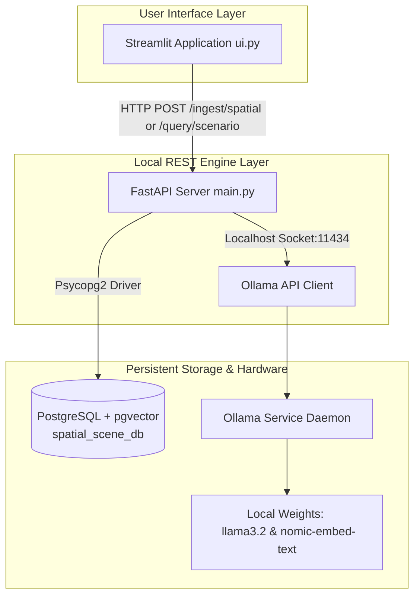
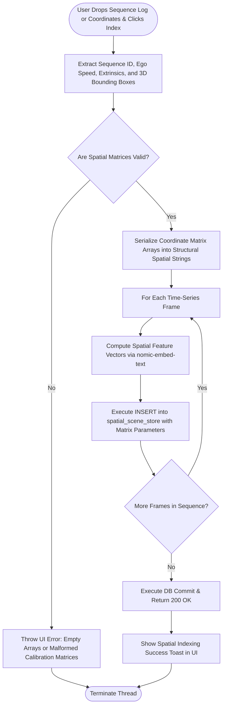
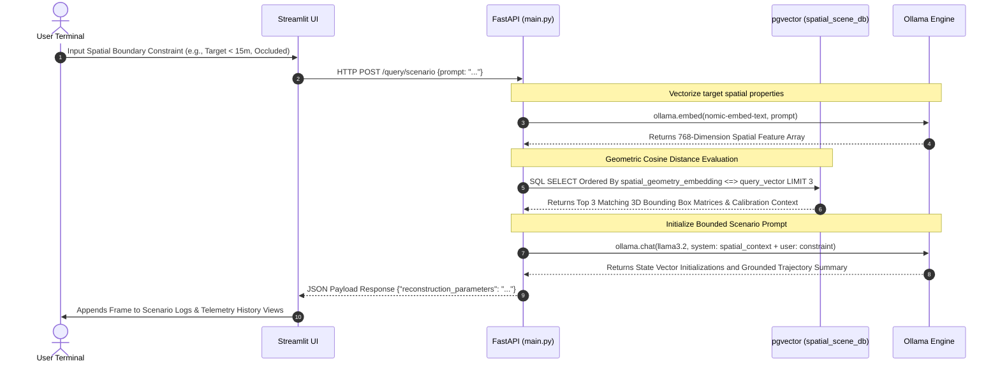

# Local 3D Scene Discovery & Volumetric Object Retrieval Engine

A fully local, high-leverage Spatial Telemetry Retrieval Engine running Retrieval-Augmented Generation (RAG) over multi-dimensional physical coordinate systems. Ingest structured 3D vehicle sequence logs, camera calibration matrices, and object tracking arrays to query, isolate, and reconstruct complex driving scenarios entirely on local machine infrastructure.

## What It Does

1. **Spatial Ingestion** — Drop time-series sequence logs (JSON metadata from nuScenes, Waymo Open Dataset, or custom IPM-processed Miata GoPro telemetry). The backend extracts the ego-vehicle velocity state, camera intrinsic ($K$) / extrinsic ($[R|t]$) matrices, and 3D bounding box layouts. It serializes these spatial relationships into structural geometric strings, generates 768-dimensional spatial feature embeddings via `nomic-embed-text` via Ollama, and indexes them within a local PostgreSQL instance clustered with the `pgvector` extension.
2. **Deterministic Query Pipeline** — Input a structural trajectory scenario or constraint profile (e.g., identifying target vectors matching explicit distance, relative heading, or occlusion parameters). The query is embedded and compared against the spatial asset store using cosine distance. The top 3 closest spatial frames are isolated and passed to `llama3.2` to generate a grounded physics summary or automatically seed state-space initialization vectors ($x = [X, Y, \\dot{X}, \\dot{Y}]^T$) for downstream 4D Kalman tracking filters.

## Requirements

- Python 3.10+ (project optimized for 3.14)
- [PostgreSQL](https://www.postgresql.org/) running locally on port `5432`
- [Ollama](https://ollama.com/) installed with local weights loaded

## Setup

### 1. PostgreSQL Spatial Database Configuration

Create the physical data cluster and enable the vector distance operator extension:

```sql
CREATE DATABASE spatial_scene_db;
\\c spatial_scene_db
CREATE EXTENSION IF NOT EXISTS vector;

```

The `spatial_scene_store` table is compiled automatically by the FastAPI backend infrastructure on the initial execution loop.

### 2. Python Host Environment Setup

Initialize your virtual environment fleet and compile dependencies:

```bash
python -m venv venv
source venv/bin/activate         # Windows: venv\\Scripts\\activate
pip install fastapi uvicorn psycopg2-binary pgvector ollama pypdf streamlit requests

```

### 3. Local Model Weight Verification

Ensure your local Ollama daemon has the correct target weights pulled to compute spatial features and generate structured summaries:

```bash
ollama pull nomic-embed-text
ollama pull llama3.2

```

## Running the Project

Launch both execution threads in separate terminal windows with active virtual environments.

**Terminal 1 — Local REST Engine Layer Backend:**

```bash
python main.py

```

The server binds to the local host address at `http://127.0.0.1:8000`.

**Terminal 2 — Spatial User Interface Frontend:**

```bash
streamlit run ui.py

```

The browser pipeline instantiates the workspace view at `http://localhost:8501`.

## Usage

1. Navigate to the **Spatial Telemetry Ingestion Workspace** in the sidebar.
2. Drop a structured tracking sequence configuration file or paste custom IPM frame coordinates into the layout.
3. Click **Compile & Index Spatial Anchors** to register the geometric data blocks into the persistent `spatial_scene_db` cluster.
4. Switch to the **Conversational Scenario Pipeline** to isolate specific trajectories, evaluate visual occlusion tracking behaviors, or output state vectors for simulation playback.

## Architecture

| Component | Role |
| --- | --- |
| Streamlit (`ui.py`) | Browser workspace for tracking configuration uploads and spatial telemetry queries |
| FastAPI (`main.py`) | Asynchronous REST backend executing structural matrix parsing and orchestration |
| PostgreSQL + pgvector | High-performance spatial indexing, coordinate clustering, and cosine similarity checking |
| Ollama + nomic-embed-text | Local text-based structural spatial encoding (768-dimensional vectors) |
| Ollama + llama3.2 | Local context-grounded LLM for trajectory synthesis and state vector initialization output |

### System Topology



### Data Ingestion Pipeline Flow



### Execution Sequence (Real-Time Scenario Chat Loop)


