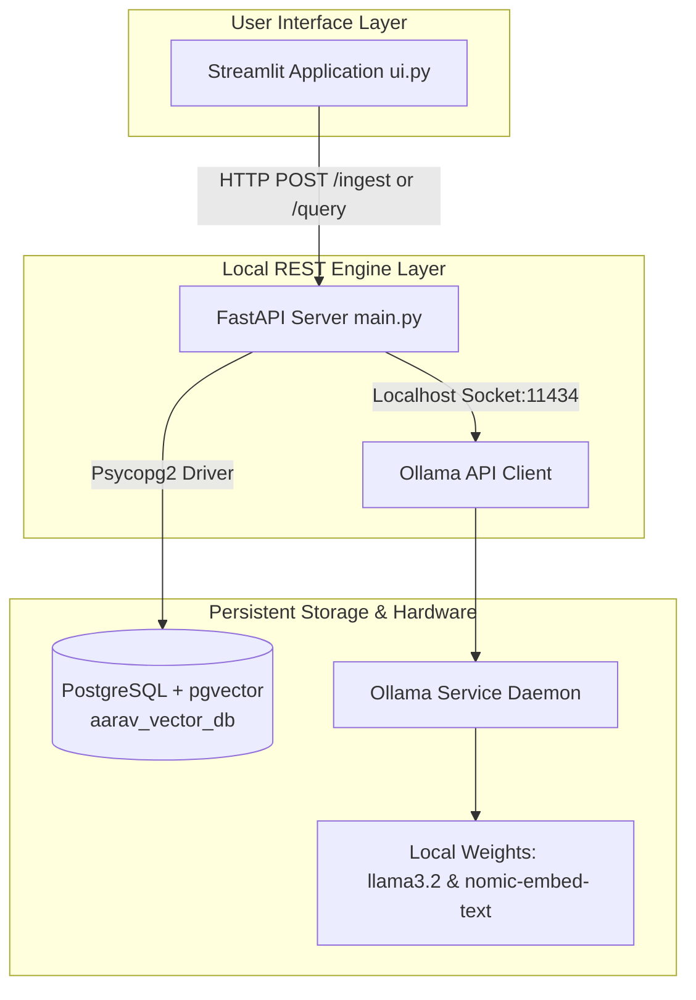
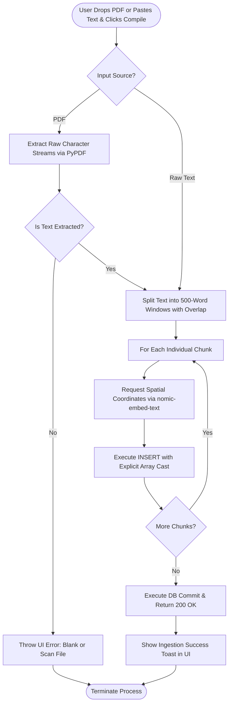
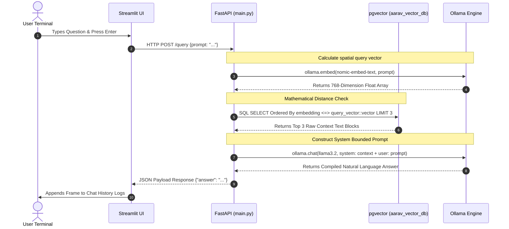

# Aarav Local RAG Engine

A fully local Retrieval-Augmented Generation (RAG) system. Upload PDF documents or paste raw text, and then ask natural language questions about that content. All processing — embeddings, vector search, and LLM inference — runs on your machine with no cloud API calls.

## What It Does

1. **Ingest** — Upload a PDF or paste text into the UI. The backend splits the content into overlapping 500-word chunks, generates a 768-dimensional embedding for each chunk using `nomic-embed-text` via Ollama, and stores the vectors in a PostgreSQL database powered by the `pgvector` extension.
2. **Query** — Ask a question in the chat interface. The question is embedded and compared against all stored vectors using cosine distance. The top 3 most relevant chunks are retrieved and passed as context to `llama3.2`, which generates a grounded answer.

## Requirements

- Python 3.10+ (project optimized for 3.14)
- [PostgreSQL](https://www.postgresql.org/) running locally on port `5432`
- [Ollama](https://ollama.com/) installed (the backend will attempt to start it automatically if it is not running)

## Setup

### 1. PostgreSQL Database

Create the database and enable the `pgvector` extension:

```sql
CREATE DATABASE aarav_vector_db;
\c aarav_vector_db
CREATE EXTENSION IF NOT EXISTS vector;
```

The `document_store` table is created automatically by the backend on first run.

### 2. Python Environment

Create and activate a virtual environment, then install dependencies:

```bash
python -m venv venv
source venv/bin/activate         # Windows: venv\Scripts\activate
pip install fastapi uvicorn psycopg2-binary pgvector ollama pypdf streamlit requests
```

### 3. Ollama Models

The backend pulls these automatically if they are missing, but you can pre-fetch them manually:

```bash
ollama pull nomic-embed-text
ollama pull llama3.2
```

## Running the Project

Open two terminal windows with the virtual environment activated in both.

**Terminal 1 — Start the backend API:**

```bash
python main.py
```

The FastAPI server starts at `http://127.0.0.1:8000`.

**Terminal 2 — Start the frontend UI:**

```bash
streamlit run ui.py
```

The Streamlit app opens in your browser at `http://localhost:8501`.

## Usage

1. Navigate to **Document Ingestion Workspace** in the sidebar.
2. Upload a PDF using the file uploader on the left, or paste text directly into the text box on the right.
3. Click **Compile & Generate Embeddings** to process and store the content into the `aarav_vector_db` cluster.
4. Switch to **Conversational Chat Pipeline** and ask questions about the ingested content.

## Architecture

| Component | Role |
|---|---|
| Streamlit (`ui.py`) | Browser-based frontend for ingestion and chat |
| FastAPI (`main.py`) | REST API backend handling ingestion and query logic |
| PostgreSQL + pgvector | Persistent vector storage and cosine similarity search |
| Ollama + nomic-embed-text | Local text embedding (768-dimensional vectors) |
| Ollama + llama3.2 | Local LLM for answer generation |

See `rag_architecture.typ` for a detailed technical breakdown of the pipeline.

### System Topology


### Data Ingestion Pipeline Flow


### Execution Sequence (Real-Time RAG Chat Loop)

